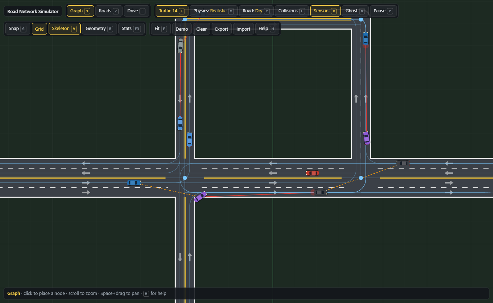
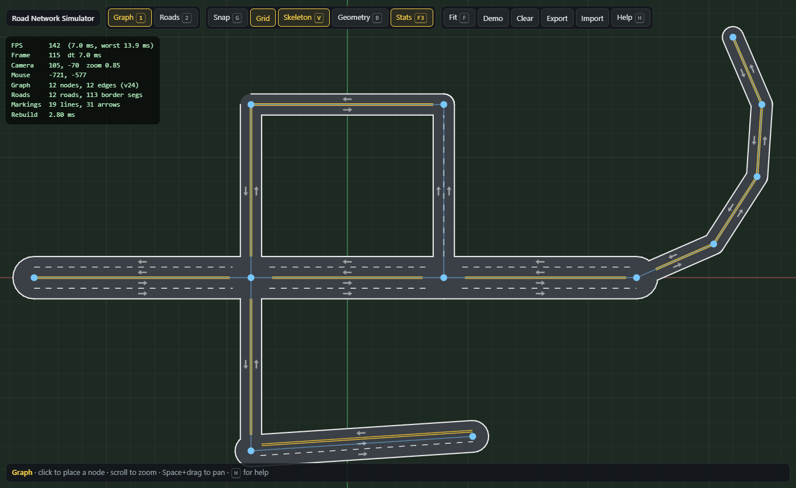
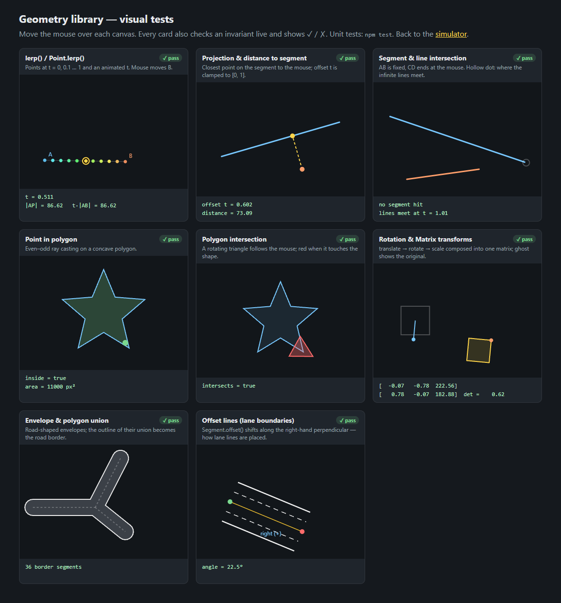
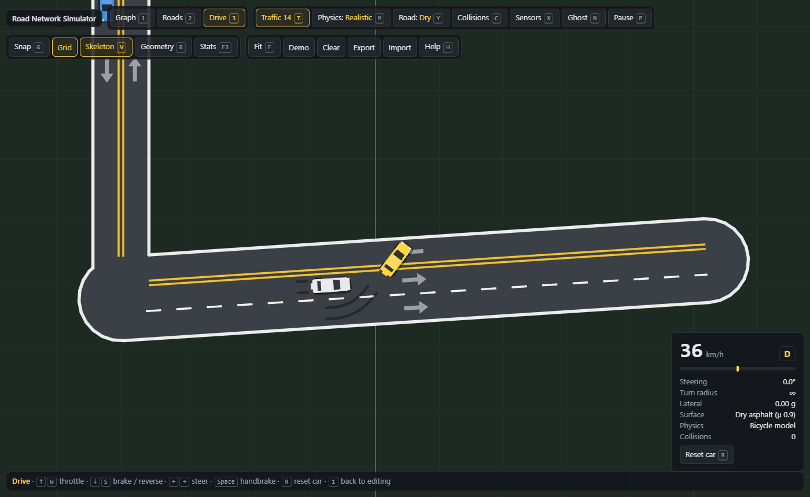
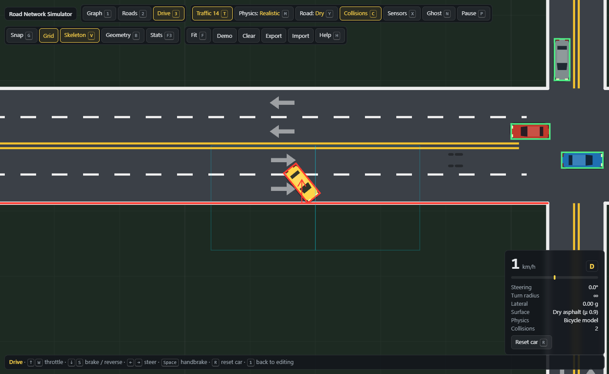
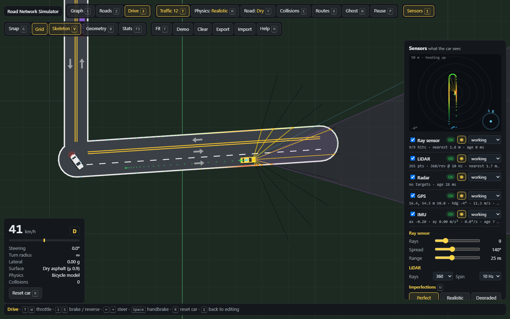
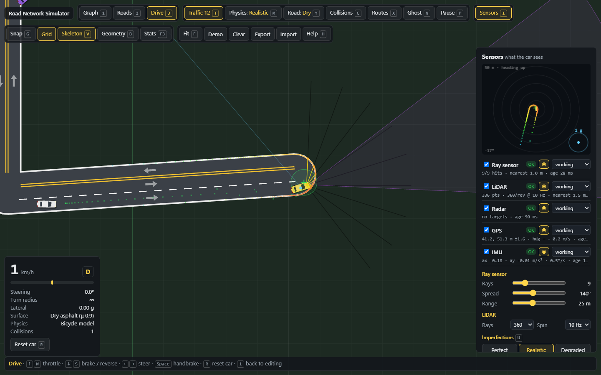

# Road Network Simulator

A 2D road network simulator built from scratch with plain HTML, CSS and JavaScript ES modules on a single `<canvas>`. There is no framework, no bundler and no runtime dependencies.

The repository currently holds three phases:

- **Phase 1: simulator foundation.** The engine, a geometry library, an editable road graph, and procedural road generation with lanes, centre lines and direction arrows.
- **Phase 2: cars.** A drivable car with a bicycle-model physics engine, SAT collision detection against road borders and other cars, and traffic vehicles that follow routes, keep their distance and get around obstacles.
- **Phase 3: sensors.** A ray sensor, a spinning LiDAR, radar, GPS and an IMU behind one standard API. Each sensor can be given noise, latency, limited range, dropped measurements and failures, so a future autonomous driver can't rely on perfect information.

**Milestone #1 reached:** a manually drivable traffic simulator.



## Quick start

ES modules don't load from `file://`, so serve the folder over HTTP:

```bash
npm start                     # npx http-server on http://localhost:8080
# or
python -m http.server 8080
```

| Page | URL |
| --- | --- |
| Simulator (press `3` to drive) | `http://localhost:8080/` |
| Geometry visual tests | `http://localhost:8080/tests/visual/` |

```bash
npm test                      # unit tests (Node ≥ 22, built-in node:test, no installs)
```

## Roadmap

| Phase | Weeks | Status |
| --- | --- | --- |
| 1. Simulator foundation | 1–4 | ✅ |
| 2. Cars | 5–8 | ✅ |
| 3. Sensors | 9–12 | ✅ |

## Phase 1: simulator foundation



| Week | Goal | Status |
| --- | --- | --- |
| 1 | **Project + Canvas engine:** game loop, delta time, camera, mouse/keyboard input, FPS counter, debug tools | ✅ |
| 2 | **Geometry library:** Point, Segment, Polygon, vector maths, `lerp()`, distances, line and polygon intersections, rotations, transformations | ✅ |
| 3 | **Road graph:** add, remove, move and connect nodes; build networks by hand | ✅ |
| 4 | **Road generation:** width, borders, centre lines, lane markings, lane count and direction; connected segments | ✅ |

### Week 1: Canvas engine (`src/engine/`)

- **`GameLoop`** runs on `requestAnimationFrame` with variable delta time in seconds. Delta is clamped so a backgrounded tab can't produce a huge step. It also has a `timeScale` for slow motion or pause.
- **`Camera`** maps world coordinates to the screen through an affine `Matrix`. It supports pan, zoom-at-cursor, fit-to-bounds and visible-bounds queries, and handles `devicePixelRatio` for sharp rendering on HiDPI screens.
- **`Input`** uses polling. DOM events only record state, and game code reads it inside `update()`. It provides `isDown` / `wasPressed` / `wasReleased` for keys and mouse buttons, mouse delta, and normalised wheel delta. `endFrame()` clears the per-frame flags.
- **Debug tools:** a smoothed FPS counter with frame time and worst frame, a live stats overlay (`F3`), an adaptive infinite grid with world axes, and a geometry debug view (`B`) that shows envelopes, vertices and bounding boxes.

### Week 2: Geometry library (`src/math/`, `src/primitives/`)

| Module | What it does |
| --- | --- |
| `utils.js` | `lerp`, `inverseLerp`, `clamp`, `snap`, segment–segment and line–line intersection (with parameters along both), bounding-box overlap |
| `Point` | Vector maths: add, subtract, scale, dot, cross, length, normalise, perpendicular, angle, distance, rotate (around any pivot), translate by angle |
| `Segment` | Length, direction, projection, distance to point, intersection, parallel offset, undirected equality |
| `Polygon` | Point containment (ray casting), polygon–polygon intersection, area, centroid, matrix transform, and **union outline** (break edges at crossings, keep the outer pieces) |
| `Matrix` | Immutable 2D affine transform: translate, rotate, rotate around a pivot, scale, multiply, invert, apply to points or set on a canvas |
| `Envelope` | Capsule polygon around a segment: the surface of a road |

Every function has a **visual test** in `tests/visual/`. Each card is interactive and checks an invariant live, so a regression shows up as ✗:



### Week 3: Road graph (`src/graph/`)

```
Point ───── Segment ───── Point
                          │
                          │
                        Point
```

- **`Graph`** stores nodes as `Point`s and edges as `Segment`s. Edges reference the node instances themselves, so moving a node moves every connected road. It rejects duplicate nodes and edges (in either direction). Removing a node removes its edges. It also supports splitting an edge, nearest-node and nearest-edge picking, and JSON serialisation. A `version` counter tells consumers when to rebuild.
- **`GraphEditor`** builds the network with the mouse: place, connect, drag, split and delete. It has optional grid snapping.
- **Persistence:** the network autosaves to `localStorage`, and you can export or import it as JSON.

### Week 4: Road generation (`src/road/`)

Each edge carries `lanes` and `oneWay`. `RoadNetwork` turns the graph into road geometry and only rebuilds when the graph's version changes:

1. **Surface:** each edge gets an `Envelope` that is `lanes × laneWidth` wide, with rounded caps so roads blend at shared nodes.
2. **Borders:** the outline of the **union** of all envelopes. Connected roads become one surface with no internal edges, however many roads meet at a node.
3. **Lane layout:** traffic drives on the right. Forward lanes (p1 → p2) sit right of the skeleton and backward lanes sit left; an odd lane count gives the extra lane to the forward direction. One-way roads put every lane forward and have no centre line.
4. **Markings:** a double yellow centre line separates the two directions, and dashed white lines separate lanes going the same way.
   - At **junctions**, markings are clipped where they enter another road's surface.
   - Through **simple bends** (a degree-2 node with the same lane layout), markings are mitred so they join without a gap.
5. **Direction arrows:** each lane gets arrows at regular intervals. They are placed by transforming an arrow template polygon with a `Matrix`.

## Phase 2: cars

| Week | Goal | Status |
| --- | --- | --- |
| 5 | **Basic car:** position, rotation, speed, acceleration, braking, reverse, friction, steering, keyboard controls | ✅ |
| 6 | **Better physics:** wheelbase, steering limits, realistic turning radius, separate acceleration and braking strengths, road friction | ✅ |
| 7 | **Collision system:** cars as polygons, car–road and car–car collisions, collision debug view | ✅ |
| 8 | **Traffic vehicles:** non-AI vehicles on routes, following distance, braking, basic obstacle avoidance | ✅ |



Physics, collisions and traffic are DOM-free like the Phase 1 modules. `Simulation` runs the whole thing headless, which is how the unit tests drive cars into walls and run a minute of traffic.

### Units

Physics is written in metres and seconds, then converted once (`src/car/units.js`). A 22-unit lane is 3.3 m wide, so 1 m ≈ 6.67 world units. The car is a 4.4 × 1.8 m hatchback with a 2.7 m wheelbase. The HUD shows real units: km/h, metres and g.

### Week 5: basic car (`src/car/`)

- **`Car`** holds a physics state (position, heading, signed speed, steering angle), its parameters and an `input` object. Anything can drive a car by writing `car.input = { forward, back, steer, handbrake }`: the keyboard does it now, traffic drivers do it too, and a later AI can do the same.
- **`stepBasic()`** is the simple model. Throttle and brake change the speed, friction slows the car without reversing it, `back` reverses once stopped, and steering turns the car at a constant rate.
- That constant turn rate is why the basic car feels like "moving a rectangle": it can spin while barely moving. Press `M` to switch back to it and compare.
- **`KeyboardControls`**: `↑`/`W` throttle, `↓`/`S` brake then reverse, `←→`/`A D` steer, `Space` handbrake.

### Week 6: better physics (`stepRealistic()`)

The car is a **kinematic bicycle model**, measured at the centre of the car:

```
slip β  = atan(½ · tan δ)
yaw ω   = v · cos β · tan δ / L          L = wheelbase, δ = front wheel angle
turning radius (rear axle) R = L / tan δ
```

- **Steering limits.** The wheels move towards the target at a limited rate (110°/s), and centre faster (220°/s). The steering lock shrinks with speed: δmax = 35° / (1 + v / 15 m/s). That gives full lock when parking and stability on fast roads.
- **Separate strengths.** The engine gives 3.5 m/s², falling off towards top speed, plus aerodynamic drag. Brakes give 9 m/s², reverse gives 2.5 m/s² and is capped at 20 km/h, and the handbrake locks the rear wheels.
- **Road friction.** Every surface has a tyre grip coefficient μ (and rolling resistance). μ·g caps braking, traction and lateral acceleration:

  | Surface | μ |
  | --- | --- |
  | Dry asphalt | 0.9 |
  | Wet asphalt | 0.55 |
  | Icy asphalt | 0.15 |
  | Grass (off road) | 0.45 |

- **Grip limit.** Past the grip limit the car understeers: it turns as tightly as the tyres allow and no more, and leaves **skid marks**. The same happens under hard braking.
- `Y` cycles the road between dry, wet and icy.

The tests check the model against its own equations. At low speed the car drives a circle of radius √((L/tan δ)² + (L/2)²) within 3%. It stops within the braking distance v²/2a that the grip allows. Lateral acceleration never exceeds μg.

### Week 7: collision system (`src/collision/`)



- **Shapes.** Every car is a rectangle `Polygon` from its pose. The road edge is the Phase 1 **border**: the outline of the union of all road surfaces, as line segments.
- **Broad phase.** Border segments go into a **spatial hash** (uniform grid). A car only tests the segments in the cells its bounding box touches. Car pairs are pre-filtered by distance and bounding box.
- **Narrow phase.** The **Separating Axis Theorem** (`sat.js`) works for convex polygons and for segments, which it treats as two-point shapes. It returns the minimum translation vector: a unit normal and a depth.
- **Response.**
  - The car is pushed out along the normal, and the velocity component into the wall is reflected with restitution 0.2.
  - Coulomb friction acts on the sliding part.
  - Cars only move along their heading, so the car is also turned slightly towards the direction it is deflected in. It scrapes along a wall instead of grinding to a halt.
  - Car–car contacts separate both cars and exchange an equal-mass inelastic impulse.
- **No tunnelling.** Physics runs in **substeps** small enough that no car moves more than 0.5 m per step, so a fast car can't skip over a thin border between frames. A unit test drives at full throttle into the border from four angles with 100 ms frames.
- **Debug view (`C`).** It shows:
  - every car's polygon: green when clear, red when hit;
  - the spatial hash cells around the player, and the border segments it is tested against (cyan);
  - contacts (red segment + normal arrow) and car–car normals (orange). They fade out over 0.6 s so one-frame hits are visible.
- **Other tools.** `N` turns on ghost mode (the player ignores collisions). The HUD counts collisions, and a scrape counts once.

### Week 8: traffic vehicles (`src/traffic/`)

Traffic is **not AI**. Each vehicle gets a planned route and a rule-based driver that only touches the pedals and steering wheel, so traffic obeys exactly the same physics as the player.

| Module | What it does |
| --- | --- |
| `RoutePlanner` | Builds a directed road graph that respects one-way roads. A route is a list of `{ road, dir }` steps. Routes are planned 10 steps ahead with a seeded RNG and extended as the car drives. There are no U-turns: a 2-lane road is narrower than a car's turning circle, so a dead end is where a route ends and the car fades out. |
| `buildPath()` | Turns a route into a lane-accurate `Path`: lane centre lines (right-hand traffic, lane counted from the kerb) joined by **circular fillets** at nodes. Each arc's radius is the largest that keeps the car clear of the junction's inner corner and stays near its lane, but never tighter than the car's turning circle. |
| `Path` | A polyline parameterised by arc length `s`. It supports point and tangent at `s`, signed curvature, and projection with a signed lateral offset. Progress, look-ahead and "is that car in my lane?" all become 1D questions. |
| `TrafficDriver` | **Steering:** a Stanley controller at the front axle (heading error + cross-track error + curvature feed-forward). **Speed:** the Intelligent Driver Model. **Perception:** a lane corridor ahead. **Avoidance:** lane changes. |
| `TrafficManager` | Spawns vehicles on random lanes with varied size, colour, desired speed (38–58 km/h) and following time (1.1–1.8 s). It replaces vehicles whose route ends. |

- **Following distance and braking (IDM):** a = a<sub>max</sub> · [1 − (v/v₀)⁴ − (s\*/s)²], where s\* = s₀ + vT + vΔv / 2√(ab). The desired speed v₀ also drops ahead of curves, using a comfortable lateral acceleration (2.2 m/s²) and a braking-distance profile.
- **Leader detection:**
  - Another car counts if its centre is in the lane corridor, or any of its corners is in this car's swept width.
  - The car also checks where every nearby car will be in 1.2 s, so it yields to vehicles about to cross its path at junctions.
  - Two cars waiting for each other are resolved by id. Patience runs out after 6 s, and a car stuck for 12 s leaves.
- **Basic obstacle avoidance.** A car stuck behind a slow or stopped vehicle for more than 1.2 s moves into a free adjacent lane going the same way. Its target slides sideways smoothly, then the route is rebuilt in the new lane.
- **Routes view (`X`).** It shows each vehicle's route (blue), its steering point, its leader (red, or dashed orange for a predicted crossing) and lane changes (purple dot).
- **Edge collisions for traffic.** Traffic follows its lanes but isn't blocked by road borders: on a 2-lane road a car can't always keep its whole body inside the border at a tight corner. The player always is. Traffic does collide with cars, and the demo-map test runs a minute of dense traffic with **zero** collisions.
- **Changing the network.** Traffic re-plans whenever you edit the network. `T` toggles traffic and `[` / `]` change the number of vehicles.

## Phase 3: sensors

| Week | Goal | Status |
| --- | --- | --- |
| 9 | **Ray sensors:** configurable raycasting against road boundaries and vehicles, every ray drawn | ✅ |
| 10 | **Simulated LiDAR:** many more rays, distance measurements, point-cloud view | ✅ |
| 11 | **Radar, GPS and IMU:** radar distance and relative velocity, GPS position and heading, IMU acceleration and rotation; one standard sensor API | ✅ |
| 12 | **Sensor imperfections:** configurable noise, latency, limited range, dropped measurements and sensor failure | ✅ |



Press `I` to open the sensor panel and draw every sensor on the map. The sensors are mounted on the player's car, which a later phase will turn into the autonomous car.

### One sensor API (`src/sensors/sensor.js`)

Every sensor extends `Sensor` and is used the same way:

```js
const radar = sim.sensors.read('radar');
// { sensor: 'radar', type: 'radar', time, receivedAt, age, data: { targets: [...] } }
sim.sensors.readAll(); // { rays, lidar, radar, gps, imu }
```

- **Timing.** A sensor samples the world at its own rate (rays 30 Hz, LiDAR packets 40 Hz, radar 20 Hz, GPS 5 Hz, IMU 100 Hz; never faster than the frame rate). `time` is when the world was sampled and `receivedAt` is when the reading arrives. Consumers only ever see **delivered** readings.
- **Units.** All data is metric: metres, m/s, m/s² and radians in the world frame (0 = +x, clockwise on screen). That is the same convention the car physics uses.
- **Subclasses.** A new sensor implements `measure(env)` (the ideal reading from ground truth) and `degrade(data, imperfections)` (the same reading after noise, range limit and drops). The base class handles rate, latency, whole-reading drop-outs and failure modes.
- **Shared ray casting.** `RayCaster` collects the road-border segments in range from the spatial hash (and nearby vehicles) once. It can then cast hundreds of rays for a LiDAR packet.

### Week 9: ray sensor (`raySensor.js`)

```
      \  |  /
        \ | /
         CAR
```

- `rayCount` rays fanned over `spread` (a 360° ring doesn't repeat its first ray), each up to `range` metres. Each ray reports the distance to the first road border or vehicle and what it hit.
- **On the map:** yellow up to the hit, black beyond it; an orange dot marks a road edge and a red dot a vehicle.
- **In the panel:** sliders change the ray count (1–41), spread (10–360°) and range (5–60 m) live.

### Week 10: simulated LiDAR (`lidar.js`)

- **Spinning beam.** A single beam spins at 5/10/20 Hz and fires 180–1440 times per turn (360 by default). Like a real unit it **streams packets**, each a slice of the turn. A scan is therefore smeared over the rotation: the first points of a turn are up to 100 ms older than the last.
- **Readings.** `read('lidar')` returns the last full revolution, assembled from the packets. Each point has its angle (car frame), its distance, what it hit, and its world position.
- **Point cloud.** Points are drawn coloured by distance (warm = near, cool = far) and fade with age within the turn. The sweeping beam is drawn too.

### Week 11: radar, GPS, IMU (`radar.js`, `gps.js`, `imu.js`)

| Sensor | Reports | Model |
| --- | --- | --- |
| Radar | `targets: [{ id, range, bearing, rangeRate }]` | 40° forward cone, 80 m. Sees vehicles (not kerbs) at the nearest point of their body. **Range rate** is the relative velocity along the line of sight (negative = closing). Targets hidden behind another vehicle or a road edge are not reported. |
| GPS | `x, y, heading, speed, accuracy` | Position error = slowly **drifting** bias (Gauss–Markov, 30 s correlation) + white noise, so the fix wanders like a real receiver's instead of jittering. Heading is course over ground, so it is `null` below 1 m/s. `accuracy` is the receiver's own 1σ estimate. |
| IMU | `ax, ay, yawRate` | Longitudinal and lateral acceleration in the car frame, plus yaw rate. Each axis has white noise plus a **bias** fixed at power-on, which is what makes dead reckoning drift. |

- **On the map:** the radar's cone, with range-rate arrows on its targets; the GPS fix, its trail and 95 % circle; and the IMU's acceleration vector.
- **The panel's car-centred view** plots what the sensors report, heading up. That includes the LiDAR cloud, the rays and radar targets (labelled with range rate), the GPS fix relative to the true position (its error), and a g-circle for the IMU.

### Week 12: sensor imperfections (`imperfections.js`)



Each sensor has a **datasheet** (`spec`): its 1σ noise per quantity, typical latency and drop-out rate. Global knobs are multiples of those values, so "noise ×2" doubles every sensor's *own* noise.

| Imperfection | Effect |
| --- | --- |
| Noise | Gaussian noise on every quantity (range, bearing, range rate, position, heading, acceleration…), plus the GPS drift and IMU bias. |
| Latency | Readings are queued and delivered `latency` seconds after sampling, so the car sees the past. On the map the ray fan visibly lags behind a fast car. |
| Limited range | The range scale shrinks every sensor's reach. |
| Dropped measurements | GPS and IMU lose whole readings. Rays, LiDAR points and radar targets are dropped one by one. |
| Failure | Per sensor: `dead` (stops reporting; the last reading just grows old), `stuck` (keeps sending the same frozen values with *fresh* timestamps, which is the hard case to detect), `intermittent` (frequent short drop-outs), plus random dead spells per minute for every sensor. |

- **Presets** (`U` cycles them):
  - **Perfect:** everything off.
  - **Realistic:** datasheet values.
  - **Degraded:** 3× noise, 4× latency, 5× drop-outs, 60 % range, 2 random failures a minute and an intermittent GPS.
- **Panel controls:** sliders fine-tune each knob, and each sensor row has its own failure selector.
- **Status badges** are ground truth for debugging: `ok`, `failed`, `stuck`, `stale`, `off`. A consumer of `read()` only sees what a real car would: readings, their timestamps and their age.
- **Reproducible noise.** All noise comes from seeded RNGs, so the tests replay exactly.

## Controls

| Input | Action |
| --- | --- |
| `W A S D` / arrows | Move camera |
| Mouse wheel | Zoom at cursor |
| Middle drag, or `Space` + drag | Pan |
| `F` / `0` | Fit network / reset view |
| `1` / `2` / `3` | Graph mode / Roads mode / Drive mode |

**Graph mode**

| Input | Action |
| --- | --- |
| Click empty space | Add a node (connected to the selected node) |
| Click a road | Split it with a new node (`Shift` to place a free node instead) |
| Click / drag a node | Select it, connect the selection to it, or move it |
| Right click | Deselect, or delete the hovered node or edge |
| `Del` / `Esc` | Delete the selected node / deselect |

**Roads mode**

| Input | Action |
| --- | --- |
| Click a road | Select it (a side panel shows its details) |
| `+` / `−` | Add / remove a lane |
| `O` | Toggle one-way |
| `R` | Reverse direction |

**Drive mode**

| Input | Action |
| --- | --- |
| `↑` / `W` | Throttle (brakes while reversing) |
| `↓` / `S` | Brake, then reverse once stopped |
| `←` `→` / `A` `D` | Steer |
| `Space` | Handbrake |
| `R` | Reset the car |
| Mouse wheel | Zoom (the camera follows the car) |

**Simulation** (any mode)

| Input | Action |
| --- | --- |
| `T` | Traffic on / off |
| `[` / `]` | Fewer / more vehicles |
| `M` | Physics model: basic (week 5) / bicycle (week 6) |
| `Y` | Road surface: dry / wet / icy |
| `C` | Collision debug view |
| `X` | Traffic routes view |
| `N` | Ghost mode (player ignores collisions) |
| `P` | Pause |
| `I` | Sensor panel + sensor views on the map |
| `U` | Sensor imperfections: perfect / realistic / degraded |

**Debug:** `F3` stats overlay · `B` geometry view · `V` graph skeleton · `G` grid snap · `Shift+G` grid · `H` help

## Project structure

```
index.html              app shell (toolbar, road panel, help, overlay)
css/style.css
src/
  main.js               wiring: loop → input → camera → editor → road network → simulation → render
  engine/               loop.js · camera.js · input.js · debug.js
  math/                 utils.js · matrix.js
  primitives/           point.js · segment.js · polygon.js · envelope.js
  graph/                graph.js · graphEditor.js · storage.js
  road/                 road.js (lane layout) · roadNetwork.js (generation + rendering)
  car/                  physics.js (basic + bicycle model) · car.js · units.js · keyboardControls.js · skidMarks.js
  collision/            sat.js · spatialHash.js · collisionWorld.js (detection + response)
  traffic/              path.js · routePlanner.js · trafficDriver.js (Stanley + IDM) · trafficManager.js
  sensors/              sensor.js (common API) · raycast.js · raySensor.js · lidar.js · radar.js · gps.js · imu.js
                        imperfections.js · noise.js · sensorSuite.js
  sim/simulation.js     cars, substepping, collisions, traffic, sensors, debug drawing
  ui/                   controls.js (toolbar & road panel) · hud.js (car dashboard) · sensorPanel.js
  data/demo.js          sample network
tests/
  unit/                 node:test suites: geometry, graph, roads, car physics, collisions, traffic, sensors
  visual/               interactive geometry test gallery
```

Every module under `math/`, `primitives/`, `graph/graph.js`, `road/`, `car/`, `collision/`, `traffic/`, `sensors/` and `sim/` is DOM-free. The unit tests run them directly in Node, and later phases can reuse them in workers.

## Design notes

- **World units vs pixels.** Geometry lives in world units. Editor handles are sized as `pixels / zoom`, so they stay the same size on screen at any zoom level.
- **Rebuild on change, not every frame.** The graph's `version` counter means road geometry is regenerated only when something changes, including while you drag a node. The overlay shows the rebuild time.
- **Bounding-box pre-filtering** keeps polygon union and marking clipping cheap, because only nearby roads are compared.
- **One input interface for every driver.** The keyboard, traffic drivers and (later) AI all just set `car.input`. Physics doesn't know who is driving.
- **Decide once per frame, integrate in substeps.** Drivers choose their inputs once per frame. Physics and collision resolution run in as many substeps as the fastest car needs.
- **Deterministic traffic.** Routes, spawns and vehicle variety come from a seeded RNG, so the regression tests replay exactly.
- **Ground truth and perception stay separate.** Sensors read the simulation's true state, but everything downstream gets only delivered sensor readings. The next phases can't cheat by peeking at the world.

## Licence

MIT
